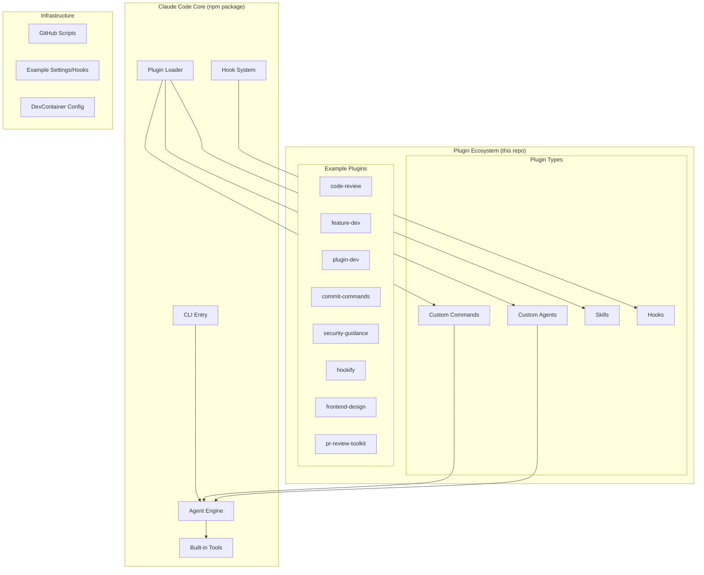

# claude-code — Overview

## What is this project?

claude-code is Anthropic's official **agentic coding tool** that lives in the terminal. It understands codebases, helps with writing code, executing commands, handling git workflows, and more — all through natural language. This open-source repository contains the **plugin ecosystem, examples, and scripts** for claude-code. The core claude-code CLI itself is distributed as an npm package (`@anthropic-ai/claude-code`).

The repository showcases the plugin system architecture: plugins extend claude-code with custom slash commands, specialized agents, hooks, MCP servers, and skills.

## Tech Stack

| Layer       | Technology |
|-------------|-----------|
| Runtime     | Node.js 18+ |
| Package     | npm (`@anthropic-ai/claude-code`) |
| Plugin Format | JSON config + Markdown (agents, skills, commands) |
| Scripts     | TypeScript, Bash (GitHub automation) |
| Examples    | JSON settings + Hook configurations |
| Distribution | npm, Homebrew, curl installer, WinGet |

## Architecture Diagram

## Core Modules at a Glance

| Module | Path | Description |
|--------|------|-------------|
| Plugins | `plugins/` | Collection of official plugins extending claude-code functionality |
| code-review | `plugins/code-review/` | Automated PR review with 5 parallel specialized agents |
| feature-dev | `plugins/feature-dev/` | 7-phase feature development workflow |
| plugin-dev | `plugins/plugin-dev/` | Toolkit for developing new plugins |
| commit-commands | `plugins/commit-commands/` | Git workflow automation (commit, push, PR) |
| security-guidance | `plugins/security-guidance/` | Security pattern monitoring hooks |
| hookify | `plugins/hookify/` | Custom hook creation for behavior control |
| frontend-design | `plugins/frontend-design/` | Frontend UI design guidance skill |
| pr-review-toolkit | `plugins/pr-review-toolkit/` | Comprehensive PR review agents |
| Examples | `examples/` | Example settings and hook configurations |
| Scripts | `scripts/` | GitHub automation scripts (TypeScript/Bash) |
| DevContainer | `Script/` | DevContainer setup script (PowerShell) |

## Entry Points

- **Users**: Install via `curl -fsSL https://claude.ai/install.sh | bash`, then run `claude` in a project directory
- **Plugin authors**: Use `plugins/plugin-dev/` to create new plugins
- **This repo**: Browse `plugins/` to understand available extensions

## Quick Navigation

- [Architecture](01_architecture.md)
- [Data Flow](02_data_flow.md)
- [Plugins index](plugins/_index.md)
- [Glossary](_glossary.md)
- [Mapping](_mapping.md)
