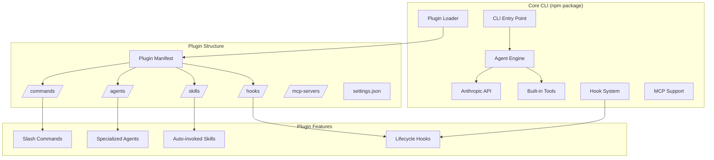

# claude-code — Architecture

## Architecture Style

**Plugin-Based Extension Architecture**: claude-code follows a plugin pattern where the core CLI (closed-source npm package) provides the agent engine, tool system, and hook infrastructure, while this repository provides the open-source plugin ecosystem. Plugins are declarative (JSON config + Markdown content) and extend functionality through commands, agents, skills, and hooks.

## High-Level Architecture Diagram



## Key Architecture Decisions

| Decision | Choice | Rationale |
|----------|--------|-----------|
| Core as npm package | Closed-source npm distribution | Commercial product with open plugin ecosystem |
| Plugin format | JSON + Markdown (declarative) | Low barrier for plugin creation, no code required for simple plugins |
| Extension points | Commands, Agents, Skills, Hooks, MCP | Covers all interaction patterns |
| Hook types | PreToolUse, PostToolUse, SessionStart, Stop, etc. | Intercept any point in the agent lifecycle |
| Agent specialization | Multiple focused agents per plugin | Each agent has narrow expertise for better quality |
| Skill auto-invocation | Skills triggered by context patterns | Seamless integration without explicit user commands |

## Module Responsibilities

| Module | Responsibility | Location |
|--------|---------------|----------|
| Plugin Loader | Discovers and loads plugins from configured paths | Core CLI |
| Hook System | Intercepts agent lifecycle events, runs hook handlers | Core CLI |
| Commands | User-invocable slash commands (`/command`) | Plugin `/commands/` dir |
| Agents | Specialized AI agents with focused prompts | Plugin `/agents/` dir |
| Skills | Auto-invoked context-aware guidance | Plugin `/skills/` dir |
| Hooks | Pre/post lifecycle event handlers | Plugin hooks config |
| Scripts | GitHub automation (issue lifecycle, duplicates, etc.) | `scripts/` dir |

## Plugin Anatomy

```
plugin-name/
├── README.md           # Plugin documentation
├── agents/             # Specialized agent definitions (Markdown)
│   └── agent-name.md   # Agent prompt and behavior
├── commands/           # Slash command definitions (Markdown)
│   └── command-name.md # Command prompt and instructions
├── skills/             # Auto-invoked skill definitions (Markdown)
│   └── skill-name.md   # Skill prompt
└── settings.json       # Plugin configuration (optional)
```

## Dependency Direction

```
Core CLI → Plugin Loader → Plugin Manifests → Plugin Content (Markdown)
                                                    ↓
                                            Agent Engine (execution)
```

- Core CLI loads plugins at startup
- Plugins are purely declarative (no runtime code in this repo)
- Plugin content (agents, commands, skills) is fed to the agent engine as context

## Extension Points

1. **New Commands**: Add a `.md` file in a plugin's `commands/` directory
2. **New Agents**: Add a `.md` file in a plugin's `agents/` directory
3. **New Skills**: Add a `.md` file in a plugin's `skills/` directory
4. **New Hooks**: Configure hook handlers in plugin settings
5. **New Plugins**: Create a new directory under `plugins/` with the standard structure
