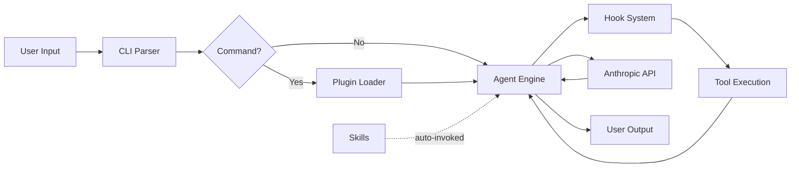

# claude-code — Data Flow

## End-to-End Data Paths

### Path 1: User Invokes a Plugin Command
```
[User types /command] → [CLI parses command] → [Plugin Loader finds command]
→ [Command .md loaded as context] → [Agent Engine executes with command prompt]
→ [Agent uses tools] → [Results displayed to user]
```
**Description**: User types a slash command (e.g., `/code-review`). The CLI looks up the command in loaded plugins, reads the command's Markdown definition, and feeds it as context to the agent engine. The agent then follows the command instructions (which may invoke sub-agents, use tools, etc.).

### Path 2: Hook Intercepts an Action
```
[Agent about to use tool] → [Hook System checks PreToolUse hooks]
→ [security-guidance hook matches pattern] → [Warning issued to user]
→ [Agent proceeds or adjusts behavior]
```
**Description**: Before certain tool uses, the hook system fires lifecycle events. Plugins like `security-guidance` register PreToolUse hooks that scan for dangerous patterns (command injection, eval, XSS, etc.) and warn the user.

### Path 3: Skill Auto-Invocation
```
[User works on frontend code] → [Skill system detects context match]
→ [frontend-design skill loaded] → [Agent guided by skill instructions]
→ [Agent produces design-aware output]
```
**Description**: Skills are automatically invoked when the conversation context matches their triggers. The `frontend-design` skill, for example, activates when working on frontend code and provides design guidance.

## Data Flow Diagram



## Data Transformation Points

| Point | Input Format | Output Format | Description |
|-------|-------------|---------------|-------------|
| Command Loading | Markdown file | Agent context/prompt | Command `.md` becomes part of agent instructions |
| Agent Loading | Markdown file | Specialized agent prompt | Agent `.md` defines the sub-agent's behavior |
| Skill Loading | Markdown file | Contextual guidance | Skill `.md` provides domain-specific instructions |
| Hook Execution | Tool use event | Warning/modification | Hook handlers process lifecycle events |
| Script Execution | GitHub events | API calls | Scripts automate GitHub issue/PR management |

## Persistence

| Store | Technology | What |
|-------|-----------|------|
| Plugin definitions | Filesystem (Markdown + JSON) | Commands, agents, skills, hooks |
| User settings | `.claude/settings.json` | Plugin configuration, API keys |
| Conversation | Core CLI internal (not in this repo) | Chat history and context |

## External Integrations

| Integration | Direction | Description |
|------------|-----------|-------------|
| Anthropic API | Outbound | LLM inference for all agent operations |
| GitHub API | Bidirectional | Issue/PR automation via scripts |
| MCP Servers | Bidirectional | External tool integration via Model Context Protocol |
| Local filesystem | Bidirectional | File read/write/search operations |
| Git | Bidirectional | Version control operations |
