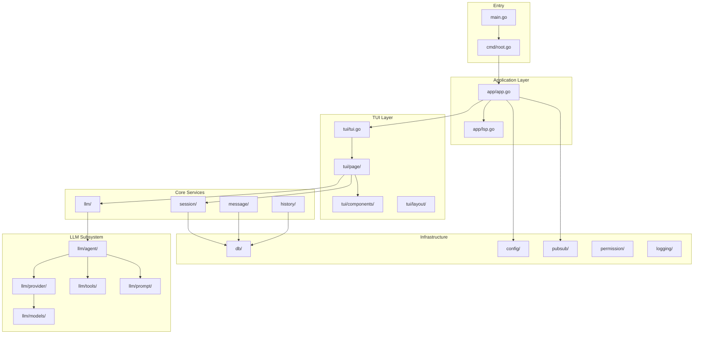

# OpenCode — Overview

## What is this project?

OpenCode is a **terminal-based AI coding assistant** written in Go. It provides an interactive TUI (Terminal User Interface) built with Bubble Tea for communicating with multiple AI providers (OpenAI, Anthropic, Google Gemini, AWS Bedrock, etc.) to assist with coding tasks. It features session management, tool integration (file editing, command execution, code search), LSP support, and persistent storage via SQLite.

> **Note**: This project has been archived and continued as [Crush](https://github.com/charmbracelet/crush) by the Charm team.

## Tech Stack

| Layer       | Technology |
|-------------|-----------|
| Language    | Go 1.24+ |
| TUI Framework | Bubble Tea (charmbracelet/bubbletea) |
| UI Styling  | Lip Gloss (charmbracelet/lipgloss) |
| AI SDKs    | anthropic-sdk-go, openai-go, google genai |
| Database    | SQLite (via go-sqlite3) |
| SQL Queries | sqlc (code generation from SQL) |
| LSP         | go-lsp (Language Server Protocol client) |
| Config      | Custom TOML/JSON config |
| Build       | Go modules |

## Architecture Diagram

## Core Modules at a Glance

| Module | Path | Description |
|--------|------|-------------|
| App | `internal/app/` | Application initialization and LSP setup |
| TUI | `internal/tui/` | Terminal user interface (Bubble Tea) |
| LLM | `internal/llm/` | LLM agent, providers, tools, and prompt management |
| Session | `internal/session/` | Conversation session management |
| Message | `internal/message/` | Chat message storage and retrieval |
| History | `internal/history/` | Conversation history management |
| DB | `internal/db/` | SQLite database layer (sqlc-generated) |
| Config | `internal/config/` | Application configuration |
| PubSub | `internal/pubsub/` | Internal event pub/sub system |
| LSP | `internal/lsp/` | Language Server Protocol client |
| Permission | `internal/permission/` | User permission management for tool execution |
| Diff | `internal/diff/` | File change diff tracking |

## Entry Points

- **main.go**: Application entry point, delegates to `cmd/root.go`
- **cmd/root.go**: CLI command setup (cobra-style)
- **internal/app/app.go**: Application initialization, launches TUI

## Quick Navigation

- [Architecture](01_architecture.md)
- [Data Flow](02_data_flow.md)
- [Internal modules](internal/_index.md)
- [Glossary](_glossary.md)
- [Mapping](_mapping.md)
