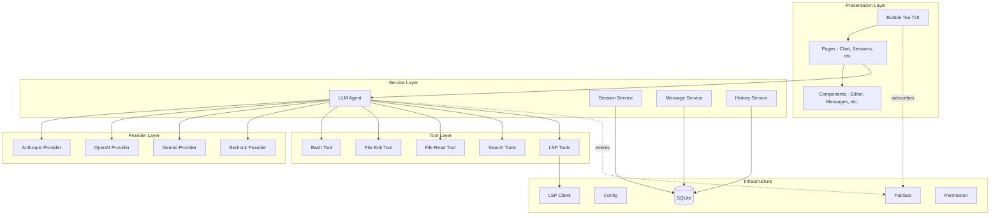

# OpenCode — Architecture

## Architecture Style

**Layered TUI Application with Agent Pattern**: OpenCode follows a standard Go project layout (`cmd/` + `internal/`). The architecture is layered: CLI entry → Application → TUI → Services (LLM, Session, Message). The LLM module uses an Agent pattern where an agent orchestrates tool calls in a loop. Internal communication uses a pub/sub event system.

## High-Level Architecture Diagram



## Key Architecture Decisions

| Decision | Choice | Rationale |
|----------|--------|-----------|
| Language | Go | Fast compilation, single binary, excellent CLI ecosystem |
| TUI Framework | Bubble Tea | Elm-architecture TUI, composable, well-maintained |
| Database | SQLite | Zero-config, embedded, perfect for local CLI tool |
| SQL Code Gen | sqlc | Type-safe SQL without ORM overhead |
| Multi-provider | Direct SDK integration | Each provider SDK for best compatibility |
| Agent Loop | Tool-call loop pattern | Agent calls LLM, LLM returns tool calls, agent executes, repeat |
| Event System | Internal pub/sub | Decouples TUI updates from service operations |
| Go internal/ | Standard Go project layout | Encapsulates implementation, exposes only CLI |

## Module Responsibilities

| Module | Responsibility | Key Interfaces |
|--------|---------------|----------------|
| `cmd/` | CLI entry, arg parsing | `root.go` command setup |
| `internal/app/` | App initialization, LSP setup | `App` struct |
| `internal/tui/` | Terminal UI rendering and interaction | Bubble Tea `Model` |
| `internal/llm/agent/` | Agent loop: LLM ↔ tool execution | `Agent` interface |
| `internal/llm/provider/` | LLM API calls per provider | `Provider` interface |
| `internal/llm/tools/` | Tool implementations (bash, edit, read, search) | `Tool` interface |
| `internal/session/` | Session CRUD | `Service` interface |
| `internal/message/` | Message CRUD | `Service` interface |
| `internal/db/` | SQLite queries (sqlc-generated) | Generated query functions |
| `internal/config/` | Config loading and management | `Config` struct |
| `internal/pubsub/` | Event publish/subscribe | `PubSub`, `Topic` |

## Dependency Direction

```
cmd/ → internal/app/ → internal/tui/ → internal/llm/ → internal/db/
                                     → internal/session/
                                     → internal/message/
```

- Entry layer depends on application layer
- Application initializes TUI with service dependencies
- TUI depends on services (LLM, session, message)
- Services depend on database layer
- PubSub is cross-cutting, used by services and TUI

## Extension Points

1. **New LLM Providers**: Implement `Provider` interface in `llm/provider/`
2. **New Tools**: Implement `Tool` interface in `llm/tools/`
3. **New TUI Pages**: Add page components in `tui/page/`
4. **New Commands**: Add CLI commands in `cmd/`
