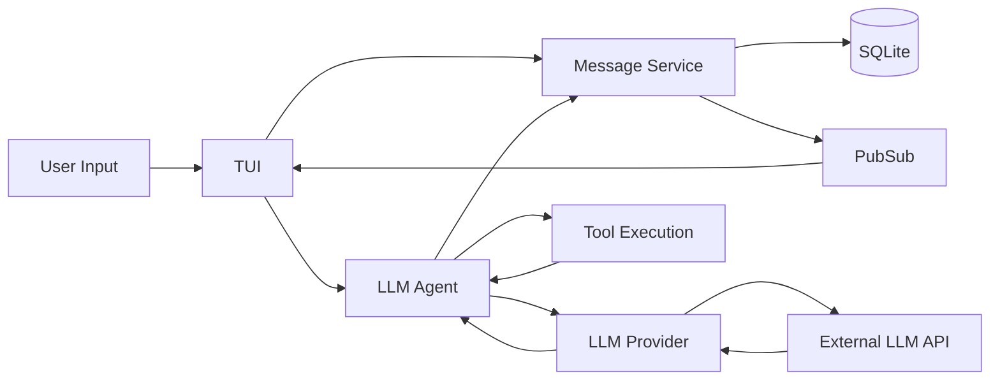

# OpenCode — Data Flow

## End-to-End Data Paths

### Path 1: User Sends a Message
```
[User types in TUI editor] → [TUI sends message] → [Message stored in SQLite]
→ [Agent receives message] → [Agent calls LLM provider] → [LLM returns response/tool calls]
→ [Agent executes tools] → [Tool results sent back to LLM] → ... → [Final response]
→ [Message stored in SQLite] → [PubSub event] → [TUI renders response]
```
**Description**: User types a message in the Bubble Tea editor. The message is persisted to SQLite, then passed to the LLM Agent. The agent sends conversation history to the selected LLM provider. If the LLM returns tool calls, the agent executes them (bash commands, file edits, etc.) and feeds results back. This loops until the LLM returns a final text response, which is stored and displayed.

### Path 2: Session Management
```
[User creates/switches session] → [Session service] → [SQLite CRUD]
→ [Load session messages] → [TUI updates view]
```
**Description**: Sessions are conversation threads persisted in SQLite. Users can create, switch, and delete sessions. Each session has its own message history.

### Path 3: LSP Integration
```
[Agent needs code intelligence] → [LSP tool called] → [LSP client]
→ [Language server] → [Diagnostics/completions] → [Agent receives result]
```
**Description**: When the agent needs code context (diagnostics, definitions, references), it calls LSP-related tools that communicate with language servers.

## Data Flow Diagram



## Data Transformation Points

| Point | Input Format | Output Format | Description |
|-------|-------------|---------------|-------------|
| TUI → Agent | User text string | Provider-specific message format | Formats user input with system prompt and history |
| Agent → Provider | Standardized messages | Provider SDK request | Converts to Anthropic/OpenAI/Gemini request format |
| Provider → Agent | Provider SDK response | Standardized response with tool calls | Normalizes responses across providers |
| Agent → Tools | Tool call parameters | Tool execution result | Executes tools and captures output |
| Messages → DB | Go structs | SQL rows | sqlc-generated serialization to SQLite |

## Persistence

| Store | Technology | What |
|-------|-----------|------|
| Sessions | SQLite | Session metadata and settings |
| Messages | SQLite | Full conversation message history |
| History | SQLite | Conversation history entries |
| Config | TOML/JSON file | Application and provider configuration |

## External Integrations

| Integration | Direction | Description |
|------------|-----------|-------------|
| Anthropic API | Outbound | Claude model inference |
| OpenAI API | Outbound | GPT model inference |
| Google Gemini API | Outbound | Gemini model inference |
| AWS Bedrock | Outbound | AWS-hosted model inference |
| Language Servers | Bidirectional | LSP for code intelligence |
| Local filesystem | Bidirectional | File read/write/search tools |
| Shell | Outbound | Bash command execution |
