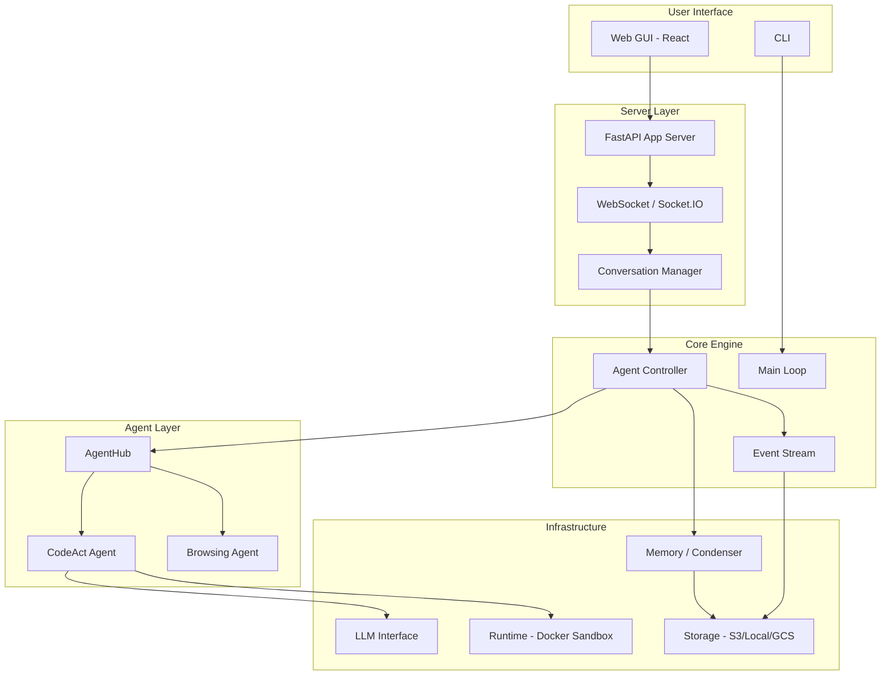

# OpenHands — Overview

## What is this project?

OpenHands (formerly OpenDevin) is an **AI-driven software development platform** — an open-source agent framework that enables AI agents to perform real-world software engineering tasks. It provides a composable Python SDK for defining and running AI agents, a CLI for interactive use, and a web-based GUI with REST API. Agents can write code, run commands, browse the web, and interact with external services, all within sandboxed runtime environments.

## Tech Stack

| Layer       | Technology |
|-------------|-----------|
| Language    | Python 3.12+ |
| Framework   | FastAPI (server), LiteLLM (LLM abstraction) |
| Frontend    | React (single-page app in `frontend/`) |
| Runtime     | Docker containers (sandboxed execution) |
| Build Tool  | Poetry / UV (Python packaging) |
| Testing     | pytest |
| Config      | TOML (`config.template.toml`) |
| WebSocket   | Socket.IO (real-time agent communication) |

## Architecture Diagram

## Core Modules at a Glance

| Module | Path | Description |
|--------|------|-------------|
| Core | `openhands/core/` | Main loop, configuration, setup, and entry points |
| Agent Controller | `openhands/controller/` | Orchestrates agent execution, manages state, detects stuck states |
| AgentHub | `openhands/agenthub/` | Collection of agent implementations (CodeAct, Browsing, etc.) |
| Events | `openhands/events/` | Event system — actions, observations, event stream, serialization |
| LLM | `openhands/llm/` | LLM abstraction layer via LiteLLM with retry, streaming, metrics |
| Runtime | `openhands/runtime/` | Sandboxed execution environment (Docker-based) |
| Memory | `openhands/memory/` | Conversation memory and context condensation |
| Server | `openhands/server/` | FastAPI web server, routes, session management, auth |
| Storage | `openhands/storage/` | Pluggable storage backends (local, S3, GCS) |
| Security | `openhands/security/` | Security policies and invariant analysis |
| Integrations | `openhands/integrations/` | External service integrations |
| MCP | `openhands/mcp/` | Model Context Protocol support |
| Resolver | `openhands/resolver/` | GitHub issue/PR resolution automation |

## Entry Points

- **CLI mode**: `openhands/core/main.py` — interactive terminal agent
- **Web server**: `openhands/server/__main__.py` → `app.py` — FastAPI application
- **Programmatic**: `openhands/core/loop.py` — main agent loop for SDK usage

## Quick Navigation

- [Architecture decisions](01_architecture.md)
- [Data flow](02_data_flow.md)
- [Core modules](openhands/_index.md)
- [Glossary](_glossary.md)
- [Spec ↔ Source mapping](_mapping.md)
