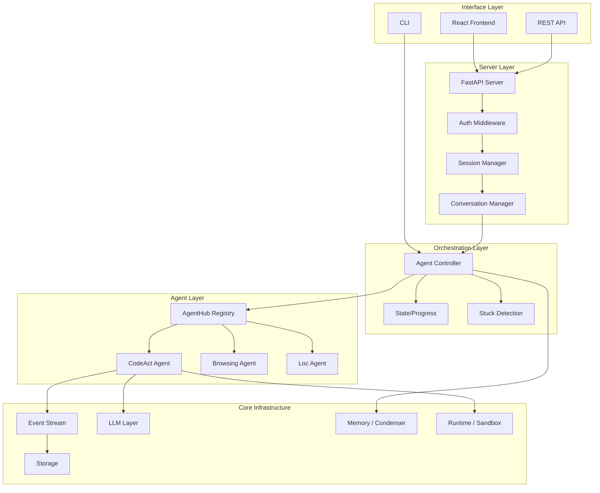

# OpenHands — Architecture

## Architecture Style

**Event-Driven Agent Framework with Plugin Architecture**: OpenHands uses an event-sourced architecture where agents communicate through an event stream. The system is layered: user interfaces (CLI/GUI) → server → controller → agents → runtime. Agents are pluggable (AgentHub pattern), LLMs are abstracted (LiteLLM), and execution is sandboxed in Docker containers.

## High-Level Architecture Diagram



## Key Architecture Decisions

| Decision | Choice | Rationale |
|----------|--------|-----------|
| Event-Sourced State | All agent actions/observations recorded as events | Full audit trail, replay capability, debugging |
| Sandboxed Runtime | Docker containers for code execution | Security isolation, reproducibility |
| Pluggable Agents | AgentHub registry pattern | Easy to add new agent types |
| LLM Abstraction | LiteLLM wrapper | Support any LLM provider via single interface |
| Pluggable Storage | Abstract storage with S3/GCS/local backends | Deployment flexibility |
| FastAPI + Socket.IO | Async web server with real-time communication | Low latency agent-user interaction |
| Memory Condensation | Condenser compresses conversation history | Handle long conversations within context limits |

## Module Responsibilities

| Module | Responsibility | Key Interfaces |
|--------|---------------|----------------|
| `core/` | Configuration, main loop, setup, logging | `main()`, `run_agent_until_done()` |
| `controller/` | Agent lifecycle, state management, stuck detection | `AgentController`, `State` |
| `agenthub/` | Agent implementations registry | `Agent` base class, specific agents |
| `events/` | Event types, stream, serialization, storage | `Event`, `EventStream`, `Action`, `Observation` |
| `llm/` | LLM API calls with retry, streaming, metrics | `LLM`, `AsyncLLM`, `StreamingLLM` |
| `runtime/` | Sandboxed execution (shell, file ops, browser) | `Runtime`, `ActionExecutionServer` |
| `memory/` | Context management and conversation condensation | `Memory`, `Condenser` |
| `server/` | HTTP/WS server, routes, sessions, auth | FastAPI app, routes, middleware |
| `storage/` | File persistence (local/S3/GCS) | `FileStore` interface |
| `security/` | Security policy enforcement | `SecurityAnalyzer` |

## Dependency Direction

```
Interface Layer → Server Layer → Orchestration Layer → Agent Layer → Infrastructure
                                                                ↓
                                                    Event Stream ← Central Bus
```

- Interface layer depends on server layer
- Server depends on controller (orchestration)
- Controller depends on agents and event stream
- Agents depend on LLM and runtime
- Event stream is the central communication backbone

## Extension Points

1. **New Agents**: Implement `Agent` base class, register in `agenthub/`
2. **New LLM Providers**: Supported via LiteLLM configuration
3. **New Storage Backends**: Implement `FileStore` interface
4. **New Runtime Types**: Extend `Runtime` base class
5. **New Integrations**: Add under `integrations/`
