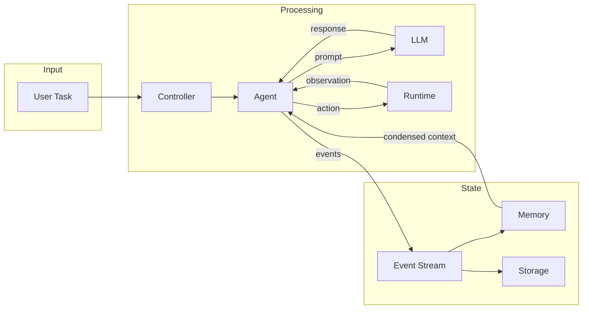

# OpenHands — Data Flow

## End-to-End Data Paths

### Path 1: User Sends a Task (CLI Mode)
```
[User Input] → [main.py] → [AgentController.start()] → [Agent.step()] → [LLM API call]
→ [LLM Response] → [Parse Action] → [Runtime.execute()] → [Observation]
→ [Event Stream.add()] → [Agent.step() again] → ... → [Task Complete]
```
**Description**: User provides a task via CLI. The main loop initializes an AgentController with the selected agent. The controller runs the agent loop: each step, the agent sends conversation history to the LLM, parses the response into an Action, executes it in the sandboxed Runtime, receives an Observation, and repeats until the task is done or budget exhausted.

### Path 2: User Sends a Task (Web GUI)
```
[Browser] → [React Frontend] → [HTTP/WebSocket] → [FastAPI Server]
→ [Session Manager] → [Conversation Manager] → [AgentController]
→ [same agent loop as Path 1] → [Events streamed back via WebSocket] → [Browser]
```
**Description**: User interacts through the React GUI. The frontend communicates via REST API and Socket.IO. The server manages sessions and conversations, delegating to the same AgentController. Events are streamed back in real-time for the user to observe.

### Path 3: Memory Condensation
```
[Event Stream grows] → [Memory.condense()] → [Condenser strategy]
→ [Summarized history] → [Shorter context for next LLM call]
```
**Description**: As conversations grow beyond LLM context limits, the Memory module uses a Condenser to compress older events into summaries, keeping the most relevant context for the agent.

## Data Flow Diagram



## Data Transformation Points

| Point | Input Format | Output Format | Description |
|-------|-------------|---------------|-------------|
| Agent.step() | Conversation history (messages) | Action object | LLM response parsed into executable action |
| Runtime.execute() | Action object | Observation object | Executes action in sandbox, returns result |
| EventStream.add() | Action/Observation | Serialized event | Persists event with metadata |
| Memory.condense() | Full event history | Condensed summary | Compresses history for context management |
| fn_call_converter | Native tool calls ↔ LLM format | Standardized format | Normalizes tool call formats across LLM providers |

## Persistence

| Store | Technology | What |
|-------|-----------|------|
| Event Store | File-based (via Storage) | Complete event history for each conversation |
| Storage Backends | Local filesystem / S3 / Google Cloud Storage | Events, session state, file artifacts |
| Configuration | TOML files | Agent config, LLM config, runtime config |

## External Integrations

| Integration | Direction | Description |
|------------|-----------|-------------|
| LLM Providers | Outbound | OpenAI, Anthropic, Google, AWS Bedrock, etc. via LiteLLM |
| Docker | Bidirectional | Sandboxed runtime environment for code execution |
| GitHub | Bidirectional | Issue/PR resolution via `resolver/` module |
| Slack/Jira/Linear | Inbound | External service integrations (enterprise) |
| MCP Servers | Bidirectional | Model Context Protocol for tool integration |
