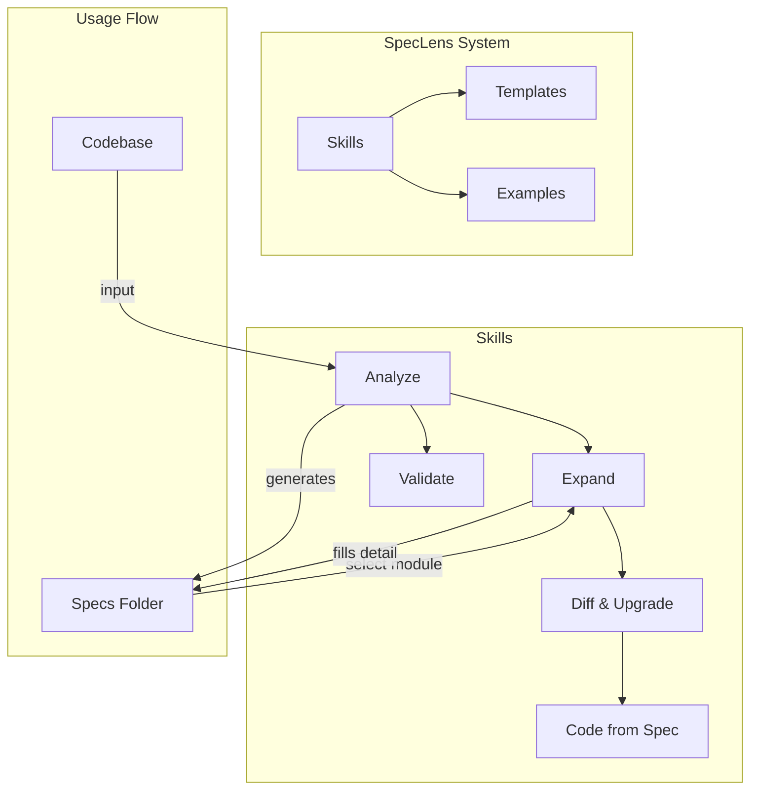

# SpecLens — Overview

## What is this project?

SpecLens is a **Skills / Prompt template system** — a collection of structured Markdown files that can be loaded into any AI Coding Agent. It helps users decompose existing codebases into layered specification documents (Specs) and use those Specs to drive AI-assisted development. The core philosophy: **Specs are the next abstraction layer; Agents are the compiler.**

SpecLens is not a traditional software application. It has no runtime, no dependencies, and no build step. It is pure Markdown — designed to be consumed by both humans and AI agents.

## Tech Stack

| Layer       | Technology |
|-------------|-----------|
| Language    | Markdown (pure text) |
| Format      | YAML frontmatter + Markdown body |
| Diagrams    | Mermaid (embedded in Markdown) |
| Version Control | Git |
| Dependencies | None (zero-dependency) |

## Architecture Diagram

## Core Modules at a Glance

| Module | Path | Description |
|--------|------|-------------|
| Analyze Skill | `skills/analyze/SKILL.md` | Analyzes a codebase and generates a mirrored Specs folder skeleton |
| Expand Skill | `skills/expand/SKILL.md` | Expands a skeleton Spec into detailed specification |
| Validate Skill | `skills/validate/SKILL.md` | Checks Specs consistency and code alignment |
| Diff & Upgrade Skill | `skills/diff-upgrade/SKILL.md` | Detects Specs changes and generates code modification plans |
| Code from Spec Skill | `skills/code-from-spec/SKILL.md` | Generates code from Spec definitions |
| Templates | `templates/` | Standard templates for all Spec file types |
| Examples | `examples/` | Real-world Specs generated by SpecLens for reference |

## Entry Points

- **For learning a project**: Start with `skills/analyze/SKILL.md` — feed it to your Agent along with a codebase
- **For expanding details**: Use `skills/expand/SKILL.md` on a skeleton Spec
- **For understanding SpecLens itself**: Read this file, then `01_architecture.md`

## Quick Navigation

- [Architecture decisions](01_architecture.md)
- [Data flow](02_data_flow.md)
- [Skills index](skills/_index.md)
- [Templates index](templates/_index.md)
- [Glossary](_glossary.md)
- [Spec ↔ Source mapping](_mapping.md)
