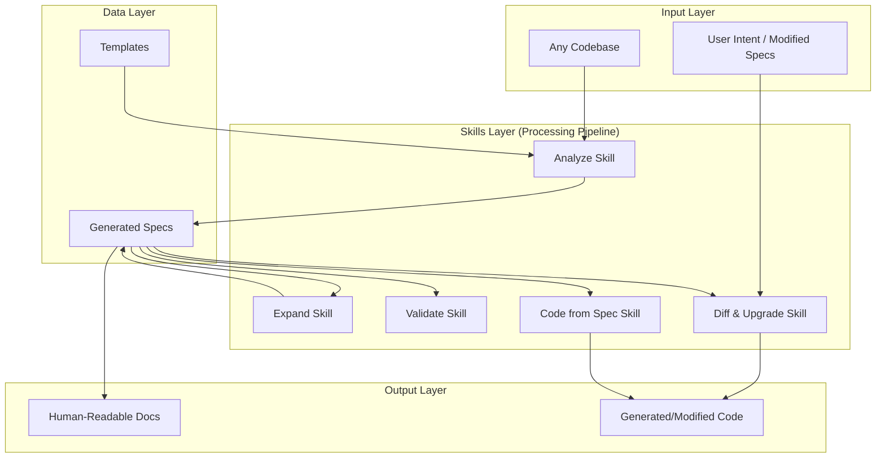

# SpecLens — Architecture

## Architecture Style

**Content-as-Architecture / Skills Pipeline**: SpecLens is not a traditional software system — it has no runtime. Its "architecture" is a structured collection of Markdown documents organized into a pipeline of Skills, each building on the output of the previous. The architecture is defined by file organization and content conventions rather than code modules.

## High-Level Architecture Diagram



## Key Architecture Decisions

| Decision | Choice | Rationale |
|----------|--------|-----------|
| Product form | Skills / Prompt templates (Markdown) | Self-consistent: "code is toilet paper, Specs are key" — so the project itself should be Specs, not code |
| No runtime dependency | Pure Markdown, zero dependencies | Maximum portability, any Agent can consume it, works forever |
| Agent-Agnostic design | Skills are natural-language instructions | Not tied to any AI platform, works with Claude, GPT, Gemini, etc. |
| Mirror source structure | Specs directory mirrors codebase directory | Enables Human-in-the-Loop debugging, easy navigation |
| Lazy loading | Skeleton-first, expand on demand | Respects user attention, avoids information overload |
| Git for versioning | Use Git branches/tags, not folder copies | Leverages existing tooling: diff, merge, blame, history |
| YAML frontmatter | Metadata in frontmatter, content in Markdown | Machine-parseable metadata + human-readable content |

## Module Responsibilities

| Module | Responsibility | Key Interfaces |
|--------|---------------|----------------|
| `skills/analyze/` | Reverse-engineer a codebase into a Specs skeleton | Input: codebase path → Output: Specs folder |
| `skills/expand/` | Deep-dive a skeleton Spec into full detail | Input: skeleton Spec → Output: detailed Spec |
| `skills/validate/` | Check Specs consistency and code alignment | Input: Specs folder → Output: consistency report |
| `skills/diff-upgrade/` | Detect Specs diff and plan code changes | Input: Specs diff → Output: change plan |
| `skills/code-from-spec/` | Generate code from Spec definitions | Input: Spec file(s) → Output: code files |
| `templates/` | Provide standard formats for all Spec types | Used by all Skills as output format reference |
| `examples/` | Showcase real-world Specs output | Reference for users and quality benchmarking |

## Dependency Direction

```
Templates ← Skills → Generated Specs
                ↓
        Source Codebase (read-only input)
```

- **Skills depend on Templates**: Skills reference templates for output formatting
- **Skills read Source Code**: Analyze and Expand read from the target codebase
- **Skills produce Specs**: All Skills write to the Specs folder
- **No circular dependencies**: The flow is strictly unidirectional

## Extension Points

1. **New Skills**: Add a new `skills/{name}/SKILL.md` file following the same structure
2. **New Templates**: Add `templates/{name}.md` for new Spec types
3. **New Examples**: Generate Specs for more projects under `examples/{project}/`
4. **Language Support**: Add `lang` parameter support in Skills for new languages
