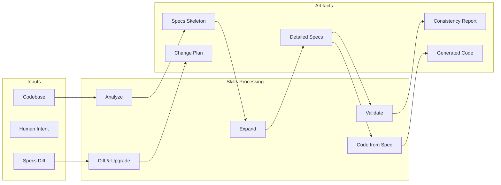

# SpecLens — Data Flow

## End-to-End Data Paths

### Path 1: Learning Mode (Reverse Engineering)
```
[Codebase] → [Analyze Skill] → [Specs Skeleton] → [Human browses] → [Select module] → [Expand Skill] → [Detailed Spec]
```
**Description**: A user points the Analyze Skill at an existing codebase. The Skill reads the source tree, README, and entry files, then generates a mirrored Specs folder with top-level content filled in and inner modules as skeletons. The user browses the overview, then selects specific modules to expand on demand.

### Path 2: Development Mode (Forward Engineering)
```
[Human Intent] → [Hand-written Specs] → [Code from Spec Skill] → [Generated Code] → [Validate Skill] → [Consistency Report]
```
**Description**: A user writes Specs by hand (or modifies existing ones) to describe intended behavior. The Code from Spec Skill reads the Spec and generates corresponding code. The Validate Skill then checks that the generated code aligns with the Spec.

### Path 3: Maintenance Mode (Iterative Evolution)
```
[Specs v1] → [Human modifies] → [Specs v2] → [Git diff] → [Diff & Upgrade Skill] → [Change Plan] → [Agent modifies code]
```
**Description**: Specs evolve over time. When a user modifies Specs, the Diff & Upgrade Skill compares versions (via Git), identifies intent changes, and generates a code modification plan for the Agent to execute.

## Data Flow Diagram



## Data Transformation Points

| Point | Input Format | Output Format | Description |
|-------|-------------|---------------|-------------|
| Analyze | Source code files | Markdown Specs (skeleton) | Transforms code structure into specification documents |
| Expand | Skeleton Spec + Source code | Detailed Markdown Spec | Enriches skeleton with deep analysis of source |
| Validate | Specs folder + Source code | Consistency report (Markdown) | Compares Specs against actual code for alignment |
| Diff & Upgrade | Git diff of Specs | Change plan (Markdown) | Translates Spec changes into actionable code tasks |
| Code from Spec | Spec file(s) | Source code files | Generates implementation from specification |

## Persistence

- **Specs files**: Stored as Markdown files on the local filesystem
- **Version history**: Managed by Git (commits, tags, branches)
- **No database**: SpecLens has no persistent state beyond files

## External Integrations

| Integration | Direction | Description |
|------------|-----------|-------------|
| Git | Read/Write | Version control for Specs; Diff & Upgrade reads git diff |
| AI Agent | Bidirectional | Skills are fed to the Agent as instructions; Agent executes them |
| Codebase | Read | Analyze and Expand read from the target project |
| Filesystem | Write | All Skills write Markdown output to the specs folder |
