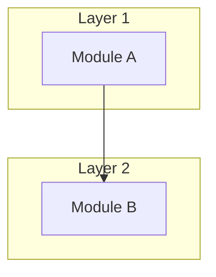

# {{Project Name}} — Architecture

## Architecture Style
<!-- e.g., Monolith, Microservices, Layered, Event-Driven, Plugin-based, etc. -->

## High-Level Architecture Diagram

## Key Architecture Decisions

| Decision | Choice | Rationale |
|----------|--------|-----------|
| ...      | ...    | ...       |

## Module Responsibilities

| Module | Responsibility | Key Interfaces |
|--------|---------------|----------------|
| ...    | ...           | ...            |

## Dependency Direction
<!-- Which layers depend on which — the direction of control flow and data flow. -->

## Extension Points
<!-- How can new features or modules be added to this architecture? -->
