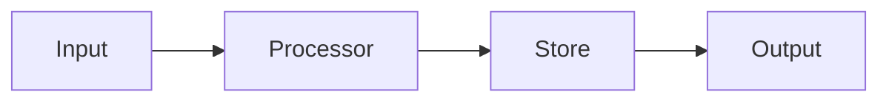

# {{Project Name}} — Data Flow

## End-to-End Data Paths
<!-- Describe primary data flows through the system from trigger to final output. -->

### Path 1: {{Name}}
```
[Trigger] → [Step 1] → [Step 2] → ... → [Output]
```
**Description**: ...

### Path 2: {{Name}}
```
[Trigger] → [Step 1] → [Step 2] → ... → [Output]
```
**Description**: ...

## Data Flow Diagram



## Data Transformation Points
<!-- Where does data change shape, get validated, or get enriched? -->

| Point | Input Format | Output Format | Description |
|-------|-------------|---------------|-------------|
| ...   | ...         | ...           | ...         |

## Persistence
<!-- Where is data stored? Databases, caches, files, etc. -->

## External Integrations
<!-- What external systems does data flow to/from? -->
