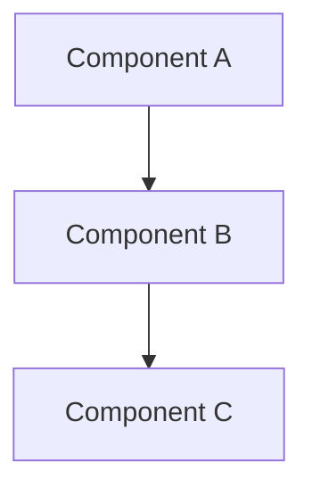

# {{Project Name}} — Overview

## What is this project?
<!-- One paragraph: what the project does, who it's for, why it exists. -->

## Tech Stack

| Layer       | Technology |
|-------------|-----------|
| Language    | ...       |
| Framework   | ...       |
| Database    | ...       |
| Build Tool  | ...       |
| Testing     | ...       |

## Architecture Diagram

## Core Modules at a Glance

| Module | Path | Description |
|--------|------|-------------|
| ...    | ...  | ...         |

## Entry Points
<!-- How the application starts, key entry files. -->

## Quick Navigation
<!-- Links to sub-specs for deeper reading. -->
