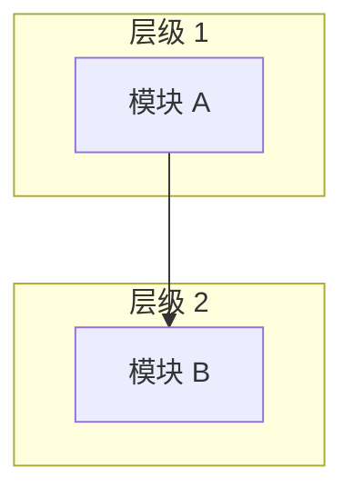

# {{项目名称}} — 架构

## 架构风格
<!-- 例如：单体、微服务、分层、事件驱动、插件式等。 -->

## 高层架构图

## 关键架构决策

| 决策 | 选择 | 理由 |
|------|------|------|
| ...  | ...  | ...  |

## 模块职责

| 模块 | 职责 | 关键接口 |
|------|------|---------|
| ...  | ...  | ...     |

## 依赖方向
<!-- 哪些层依赖哪些层——控制流和数据流的方向。 -->

## 扩展点
<!-- 如何向该架构中添加新功能或新模块？ -->
