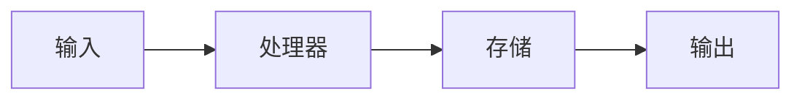

# {{项目名称}} — 数据流

## 端到端数据路径
<!-- 描述数据从触发到最终输出的主要流动路径。 -->

### 路径 1：{{名称}}
```
[触发] → [步骤 1] → [步骤 2] → ... → [输出]
```
**描述**：...

### 路径 2：{{名称}}
```
[触发] → [步骤 1] → [步骤 2] → ... → [输出]
```
**描述**：...

## 数据流图



## 数据转换点
<!-- 数据在哪里发生格式变换、校验或内容增强？ -->

| 节点 | 输入格式 | 输出格式 | 描述 |
|------|---------|---------|------|
| ...  | ...     | ...     | ...  |

## 持久化
<!-- 数据存储在哪里？数据库、缓存、文件等。 -->

## 外部集成
<!-- 数据流向/来自哪些外部系统？ -->
