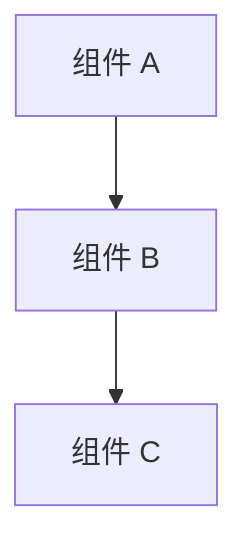

# {{项目名称}} — 全景概览

## 项目是什么？
<!-- 一段话：项目做什么、面向谁、为什么存在。 -->

## 技术栈

| 层级     | 技术     |
|----------|---------|
| 编程语言 | ...     |
| 框架     | ...     |
| 数据库   | ...     |
| 构建工具 | ...     |
| 测试框架 | ...     |

## 架构图

## 核心模块一览

| 模块 | 路径 | 描述 |
|------|------|------|
| ...  | ...  | ...  |

## 入口点
<!-- 应用如何启动、关键入口文件。 -->

## 快速导航
<!-- 链接到子 Spec，方便深入阅读。 -->
